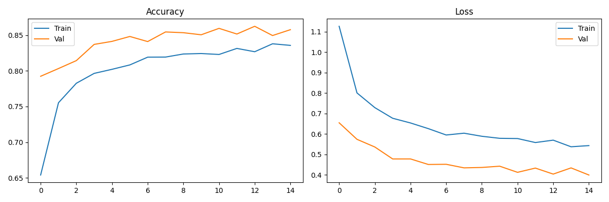
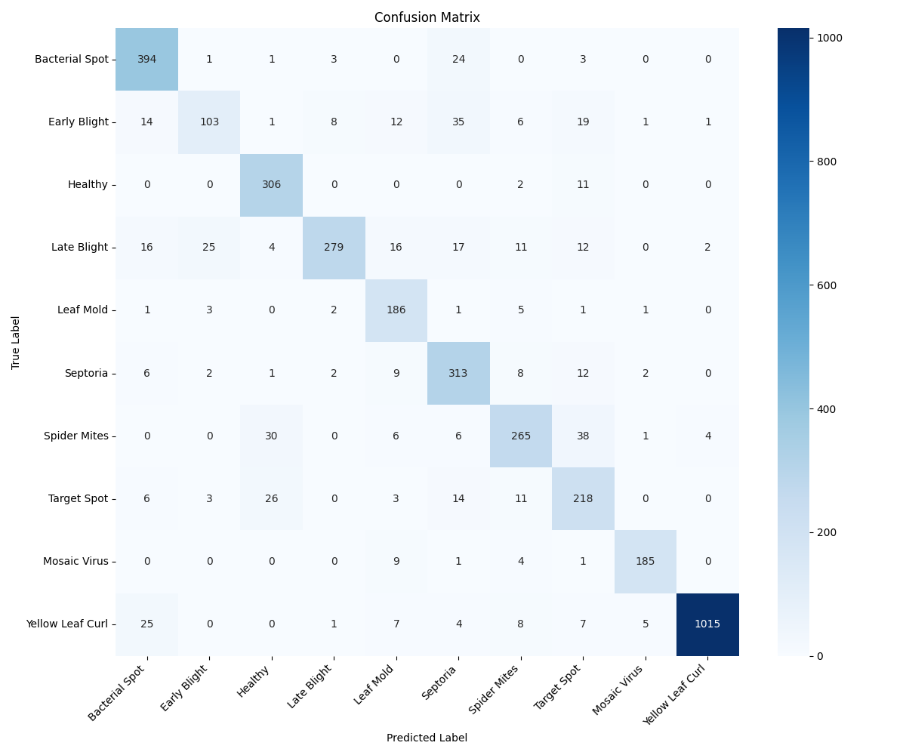

# 🍅 Tomato Leaf Disease Detector

A deep learning web application that classifies tomato leaf diseases from photos using transfer learning with MobileNetV2. Upload a photo of a tomato leaf and get an instant diagnosis with recommended actions.

---

## 📋 Table of Contents

- [Overview](#overview)
- [Disease Classes](#disease-classes)
- [Model Performance](#model-performance)
- [Tech Stack](#tech-stack)
- [Project Structure](#project-structure)
- [Getting Started](#getting-started)
- [Running the App](#running-the-app)
- [Training the Model](#training-the-model)
- [Results](#results)
- [Team](#team)

---

## Overview

This project was built as part of a machine learning course. The goal is to help farmers and agricultural workers identify tomato plant diseases early using a simple photo scanner web app — no technical knowledge required.

The model was trained on 15,097 images across 10 disease categories using transfer learning with MobileNetV2 pretrained on ImageNet. It achieves **86% overall accuracy** on the test set of 3,785 images.

---

## Disease Classes

The model can identify the following 10 conditions:

| # | Class | Description |
|---|---|---|
| 1 | Bacterial Spot | Bacterial infection causing dark spots |
| 2 | Early Blight | Fungal disease with concentric ring patterns |
| 3 | Healthy | No disease detected |
| 4 | Late Blight | Fast-spreading water mold infection |
| 5 | Leaf Mold | Fungal disease in humid conditions |
| 6 | Septoria Leaf Spot | Fungal spots with dark borders |
| 7 | Spider Mites | Tiny pest infestation causing stippling |
| 8 | Target Spot | Fungal disease with target-like lesions |
| 9 | Tomato Mosaic Virus | Viral disease causing mosaic color patterns |
| 10 | Yellow Leaf Curl Virus | Viral disease causing yellowing and curling |

---

## Model Performance

| Metric | Score |
|---|---|
| Overall Accuracy | 86% |
| Weighted F1 Score | 0.86 |
| Best Class (Yellow Leaf Curl) | F1: 0.97 |
| Weakest Class (Early Blight) | F1: 0.61 |

### Per-Class Results

| Class | Precision | Recall | F1-Score |
|---|---|---|---|
| Bacterial Spot | 0.85 | 0.92 | 0.89 |
| Early Blight | 0.75 | 0.52 | 0.61 |
| Healthy | 0.83 | 0.96 | 0.89 |
| Late Blight | 0.95 | 0.73 | 0.82 |
| Leaf Mold | 0.75 | 0.93 | 0.83 |
| Septoria Leaf Spot | 0.75 | 0.88 | 0.81 |
| Spider Mites | 0.83 | 0.76 | 0.79 |
| Target Spot | 0.68 | 0.78 | 0.72 |
| Mosaic Virus | 0.95 | 0.93 | 0.94 |
| Yellow Leaf Curl | 0.99 | 0.95 | 0.97 |

---

## Tech Stack

| Category | Tools |
|---|---|
| Language | Python 3.11 |
| Deep Learning | TensorFlow / Keras |
| Base Model | MobileNetV2 (pretrained on ImageNet) |
| Training Hardware | Google Colab (Tesla T4 GPU) |
| Web App | Streamlit |
| Data Processing | NumPy, Pillow |
| Evaluation | scikit-learn, Seaborn, Matplotlib |
| Version Control | Git, GitHub |

---

## Project Structure

```
tomato_disease_detector/
│
├── data/
│   ├── train/              ← Training images (10 class subfolders)
│   └── test/               ← Test images (10 class subfolders)
│
├── models/
│   ├── model.h5            ← Trained Keras model
│   ├── model.onnx          ← ONNX model for deployment
│   ├── training_history.png
│   └── confusion_matrix.png
│
├── notebooks/
│   └── training.ipynb      ← Google Colab training notebook
│
├── src/
│   ├── train.py            ← Model training script
│   ├── evaluate.py         ← Evaluation and confusion matrix
│   ├── predict.py          ← Single image prediction
│   └── preprocess.py       ← Image preprocessing and augmentation
│
├── app/
│   └── app.py              ← Streamlit web application
│
├── requirements.txt
├── .gitignore
└── README.md
```

---

## Getting Started

### Prerequisites

- Python 3.11 or higher
- Git

### Installation

1. Clone the repository:
```bash
git clone https://github.com/tomandjerry17/tomato-leaf-detector.git
cd tomato-leaf-detector
```

2. Create and activate a virtual environment:
```bash
python -m venv venv
venv\Scripts\activate        # Windows
source venv/bin/activate     # Mac/Linux
```

3. Install dependencies:
```bash
pip install tensorflow pillow numpy streamlit scikit-learn matplotlib seaborn
```

4. Download the trained model:

The `model.h5` file is not included in the repository due to size. Download it from the link below and place it in the `models/` folder:

> 📥 [Download model.h5 from Google Drive](YOUR_GOOGLE_DRIVE_LINK_HERE)

---

## Running the App

From the project root with your virtual environment active:

```bash
streamlit run app/app.py
```

The app will open automatically at `http://localhost:8501`.

**How to use:**
1. Click **Browse files** to upload a tomato leaf photo (JPG or PNG)
2. Wait for the model to analyze the image
3. View the predicted disease, confidence score, and recommended action

---

## Training the Model

Training was done in Google Colab using a free Tesla T4 GPU. To retrain:

1. Upload the project folder to Google Drive
2. Open `notebooks/training.ipynb` in Google Colab
3. Set Runtime to **T4 GPU** (Runtime → Change runtime type)
4. Run all cells in order

Training takes approximately 30–45 minutes for 15 epochs on a T4 GPU.

### Training Configuration

| Parameter | Value |
|---|---|
| Base model | MobileNetV2 (frozen) |
| Input size | 224 × 224 × 3 |
| Batch size | 16 |
| Epochs | 15 (early stopping) |
| Optimizer | Adam (lr=0.001) |
| Loss | Sparse Categorical Crossentropy |
| Class weighting | Yes (handles imbalanced dataset) |

---

## Results

### Training History



### Confusion Matrix



---

## Dataset

- **Source:** [Tomato Leaf Disease Classification — Kaggle](https://www.kaggle.com/datasets/)
- **Total images:** 18,882
- **Train split:** 15,097 images (80%)
- **Test split:** 3,785 images (20%)
- **Classes:** 10

> ⚠️ The dataset is not included in this repository due to size (~1GB). Download it from Kaggle and place the contents in the `data/train/` and `data/test/` folders following the folder structure above.

---

## Team

- [Add your group members' names here]

---

## License

This project is for academic purposes.

How to run: python -m streamlit run app/app.py